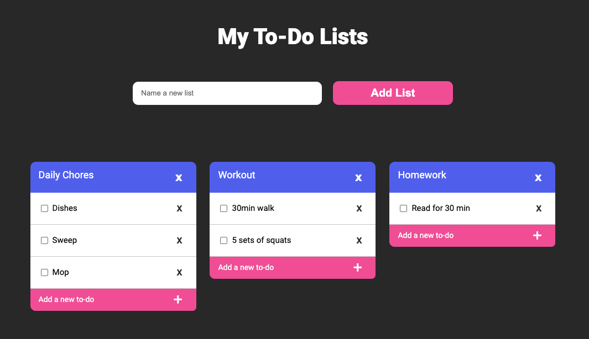
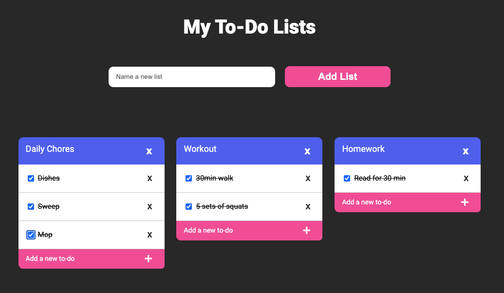
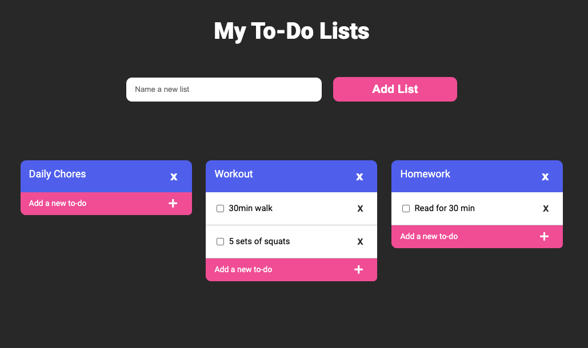
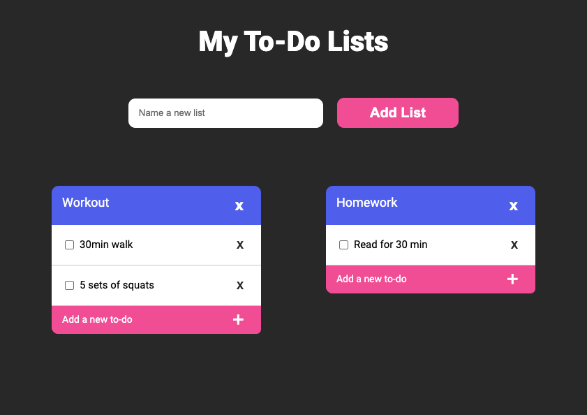
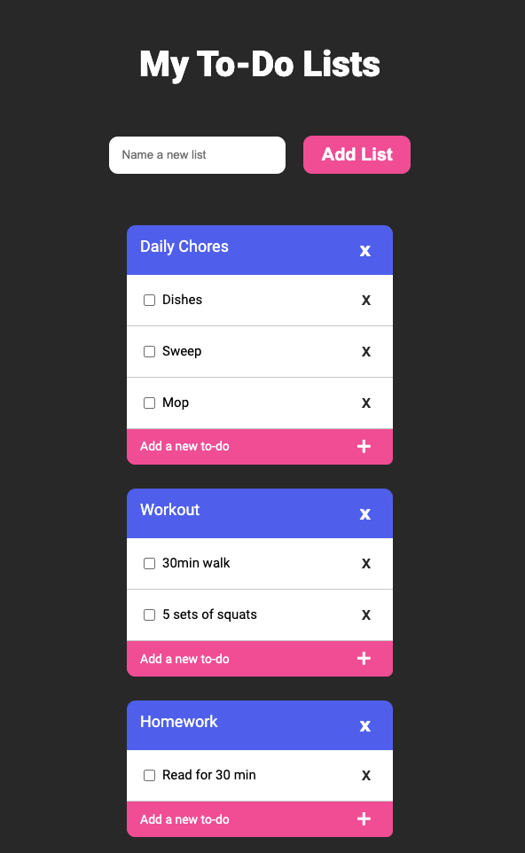

# Multi-Lists

Learn more about the developer: https://www.linkedin.com/in/kara-gardner-48a077103/

This project was created for the DevMountain Foundations course. It is a website that allows the user to create and interact with multiple to-do lists. 

Watch the demo:  https://youtu.be/wmXA-cNOT90

### Technology

HTML5, CSS3, Javascript, AXIOS, Node.js, CORS, Express, JSON, Google Fonts API

### Features

1. Create A List
⋅⋅* To create a list the user can type a list name, for example Errands,  within the input box and use either the enter key or click the add list button to populate the new list. When the data is sent by the user an axios post request sends a data object containing an id and name, to be stored on the server.

2. Add A To-Do
⋅⋅* In the new list the user can click into the pink “Add a new to-do” input box and type out their new task (ex. Return library books). Clicking on the plus button will then add the task to the list. Like before, an axios post request sends an object that contains an id, the input value, as well as a key that contains the list id that it was made from. A function on the client side takes this data and uses inner html to append this new object to the inner html of the function that displays the list object. The user can now see the to-do that they created within their list.

3. Check/Cross Off A To-Do
⋅⋅* A to-do can be marked as completed by clicking on the check-box next to it or by clicking on the name itself. The checkbox will show a checkmark and the to-do will show that it has been crossed-off. Clicking again will remove the check and line from the to-do.

4. Delete A To-Do
⋅⋅* A to-do can be completed removed by clicking the x button to it’s right. An axios delete request is used to delete this object according to it’s id.

5. Delete A List
⋅⋅* A list can also be removed by clicking the x button in the top right corner of the list by using an axios delete request with it’s specific list id. 

### Screenshots

